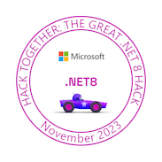

<h1>Hi there, I'm 🤣👉🤡ZNH</h1>

A Internet Fundamentalists. Full Stack Developer interested in multiple directions. 

[![][github-follower-sheild]][github-follower-link]
[![][github-star-sheild]][github-star-link]
[![][bilibili-shield]][bilibili-link]
[![][telegram-shield]][telegram-link]

### 💫 Dev Stack

| ![][h-language] | ![][language-csharp]  ![][language-python] ![][language-cpp] ![][language-asm] ![][language-cuda] ![][language-js] ![][language-php]   ![][language-fortran]             |
| :-------------- | :----------------------------------------------------------------------------------------------------------------------------------------------------------------------- |
| ![][h-framework]| ![][framework-aspdotnet] ![][framework-wpf] ![][framework-bootstrap] ![][framework-vue] ![][framework-torch]  ![][framework-wordpress]                                   |
| ![][h-ide]      | ![][ide-visualstudio] ![][ide-vscode]  ![][ide-pycharm]  ![][ide-unity]                                                                                                  |
| ![][h-os]       | ![][os-win] ![][os-wsl] ![][os-hyperv] ![][os-ubuntu] ![][os-kali]                                                                                                                      |
| ![][h-shell]    | ![][shell-terminal] ![][shell-bash]                                                                                                                                      |
| ![][h-database] |  ![][database-sqlite] ![][database-sqlserver] ![][database-mysql] ![][database-mariadb]                                                                                  |
| ![][h-other]    | ![][other-chatgpt] ![][other-azure] ![][other-huggingface] ![][other-nginx] ![][other-cloudflare] ![][other-gee] ![][other-x64dbg]  ![][other-ida]                                              |

### ⭐️ Projects
| [**💾 FastLZMA2Net**][fastlzma2net-link]  Fast LZMA2 Wrapper for .NET    [![][fastlzma2net-stars-shield]][fastlzma2net-stars-link] [![][fastlzma2net-license-shield]][fastlzma2net-license-link] [![][fastlzma2net-release-shield]][fastlzma2net-release-link] [![][fastlzma2net-releasedate-shield]][fastlzma2net-releasedate-link] [![][fastlzma2net-nuget-shield]][fastlzma2net-nuget-link] [![][fastlzma2net-downloads-shield]][fastlzma2net-downloads-link] |    |
| :-------------------------------------------------------------------------------------------------------------------------------------------------------------------------------------------------------------------------------------------- | :----------------------------------------- |
| [**🖼️ Electrical Weathering**][electrical-weathering-link]   A weared meme like a medal. An internet veteran medal.    [![][electrical-weathering-stars-shield]][electrical-weathering-stars-link] [![][electrical-weathering-license-shield]][electrical-weathering-license-link] [![][electrical-weathering-release-shield]][electrical-weathering-release-link] [![][electrical-weathering-releasedate-shield]][electrical-weathering-releasedate-link] [![][electrical-weathering-downloads-shield]][electrical-weathering-downloads-link] |    |
| [**🌎 VSOP2013.NET**][vsop2013-link]  VSOP2013 Library For .NET Package. (NuGet, DLL) Highly Optimized and OOP   [![][vsop2013-stars-shield]][vsop2013-stars-link] [![][vsop2013-license-shield]][vsop2013-license-link]  [![][vsop2013-releasedate-shield]][vsop2013-releasedate-link] [![][vsop2013-nuget-shield]][vsop2013-nuget-link] [![][vsop2013-downloads-shield]][vsop2013-downloads-link] |  |
| [**🎶 NCMDump.NET**][ncmdump-link]  Decipher .ncm file to mp3 & flac   [![][ncmdump-stars-shield]][ncmdump-stars-link] [![][ncmdump-license-shield]][ncmdump-license-link] [![][ncmdump-release-shield]][ncmdump-release-link] [![][ncmdump-releasedate-shield]][ncmdump-releasedate-link] [![][ncmdump-downloads-shield]][ncmdump-downloads-link] |  |

[fastlzma2net-link]: https://github.com/kingsznhone/FastLZMA2Net
[fastlzma2net-cover]: https://raw.githubusercontent.com/kingsznhone/FastLZMA2Net/main/readme/benchmark.png
[fastlzma2net-stars-shield]: https://img.shields.io/github/stars/kingsznhone/FastLZMA2Net?color=ffcb47&labelColor=black&style=flat-square
[fastlzma2net-stars-link]: https://github.com/kingsznhone/FastLZMA2Net/stargazers
[fastlzma2net-license-shield]: https://img.shields.io/github/license/kingsznhone/FastLZMA2Net?labelColor=black&style=flat-square
[fastlzma2net-license-link]: https://github.com/kingsznhone/FastLZMA2Net/blob/main/LICENSE
[fastlzma2net-release-shield]: https://img.shields.io/github/v/release/kingsznhone/FastLZMA2Net?color=369eff&labelColor=black&logo=github&style=flat-square&include_prereleases
[fastlzma2net-release-link]: https://github.com/kingsznhone/FastLZMA2Net/releases
[fastlzma2net-releasedate-shield]: https://img.shields.io/github/release-date-pre/kingsznhone/FastLZMA2Net?labelColor=black&style=flat-square
[fastlzma2net-releasedate-link]: https://github.com/kingsznhone/FastLZMA2Net/releases
[fastlzma2net-nuget-shield]:https://img.shields.io/nuget/v/FastLZMA2Net?style=flat-square&labelColor=000000
[fastlzma2net-nuget-link]:https://www.nuget.org/packages/FastLZMA2Net/
[fastlzma2net-downloads-shield]:https://img.shields.io/nuget/dt/FastLZMA2Net?style=flat-square&logo=nuget&labelColor=black
[fastlzma2net-downloads-link]:https://www.nuget.org/packages/FastLZMA2Net

[electrical-weathering-link]: https://github.com/kingsznhone/Electrical-Weathering
[electrical-weathering-cover]: https://raw.githubusercontent.com/kingsznhone/Electrical-Weathering/master/WeatheringSkia.png
[electrical-weathering-stars-shield]: https://img.shields.io/github/stars/kingsznhone/Electrical-Weathering?color=ffcb47&labelColor=black&style=flat-square
[electrical-weathering-stars-link]: https://github.com/kingsznhone/Electrical-Weathering/stargazers
[electrical-weathering-license-shield]: https://img.shields.io/github/license/kingsznhone/Electrical-Weathering?labelColor=black&style=flat-square
[electrical-weathering-license-link]: https://github.com/kingsznhone/Electrical-Weathering/blob/main/LICENSE
[electrical-weathering-release-shield]: https://img.shields.io/github/v/release/kingsznhone/Electrical-Weathering?color=369eff&labelColor=black&logo=github&style=flat-square
[electrical-weathering-release-link]: https://github.com/kingsznhone/Electrical-Weathering/releases
[electrical-weathering-releasedate-shield]: https://img.shields.io/github/release-date/kingsznhone/Electrical-Weathering?labelColor=black&style=flat-square
[electrical-weathering-releasedate-link]: https://github.com/kingsznhone/Electrical-Weathering/releases
[electrical-weathering-downloads-shield]: https://img.shields.io/github/downloads/kingsznhone/Electrical-Weathering/total?labelColor=black&style=flat-square
[electrical-weathering-downloads-link]: https://github.com/kingsznhone/Electrical-Weathering/releases

[vsop2013-link]: https://github.com/kingsznhone/vsop2013.net
[vsop2013-cover]: https://raw.githubusercontent.com/kingsznhone/VSOP2013.NET/main/README/Demo.png
[vsop2013-stars-shield]: https://img.shields.io/github/stars/kingsznhone/vsop2013.net?color=ffcb47&labelColor=black&style=flat-square
[vsop2013-stars-link]: https://github.com/kingsznhone/vsop2013.net/stargazers
[vsop2013-license-shield]: https://img.shields.io/github/license/kingsznhone/vsop2013.net?labelColor=black&style=flat-square
[vsop2013-license-link]: https://github.com/kingsznhone/vsop2013.net/blob/main/LICENSE
[vsop2013-releasedate-shield]: https://img.shields.io/github/release-date/kingsznhone/vsop2013.net?labelColor=black&style=flat-square
[vsop2013-releasedate-link]: https://github.com/kingsznhone/vsop2013.net/releases
[vsop2013-nuget-shield]:https://img.shields.io/nuget/v/VSOP2013.NET?style=flat-square&labelColor=000000
[vsop2013-nuget-link]:https://www.nuget.org/packages/VSOP2013.NET/
[vsop2013-downloads-shield]: https://img.shields.io/nuget/dt/VSOP2013.NET?style=flat-square&labelColor=000000&logo=nuget
[vsop2013-downloads-link]: https://www.nuget.org/packages/VSOP2013.NET/

[ncmdump-link]: https://github.com/kingsznhone/ncmdump.net
[ncmdump-cover]: https://raw.githubusercontent.com/kingsznhone/NCMDump.NET/main/README/light.png
[ncmdump-stars-shield]: https://img.shields.io/github/stars/kingsznhone/ncmdump.net?color=ffcb47&labelColor=black&style=flat-square
[ncmdump-stars-link]: https://github.com/kingsznhone/ncmdump.net/stargazers
[ncmdump-license-shield]: https://img.shields.io/github/license/kingsznhone/ncmdump.net?labelColor=black&style=flat-square
[ncmdump-license-link]: https://github.com/kingsznhone/ncmdump.net/blob/main/LICENSE
[ncmdump-release-shield]: https://img.shields.io/github/v/release/kingsznhone/ncmdump.net?color=369eff&labelColor=black&logo=github&style=flat-square
[ncmdump-release-link]: https://github.com/kingsznhone/ncmdump.net/releases
[ncmdump-releasedate-shield]: https://img.shields.io/github/release-date/kingsznhone/ncmdump.net?labelColor=black&style=flat-square
[ncmdump-releasedate-link]: https://github.com/kingsznhone/ncmdump.net/releases
[ncmdump-downloads-shield]: https://img.shields.io/github/downloads/kingsznhone/ncmdump.net/total?labelColor=black&style=flat-square
[ncmdump-downloads-link]: https://github.com/kingsznhone/ncmdump.net/releases

[github-follower-sheild]: https://img.shields.io/github/followers/kingsznhone?logo=github&style=flat-square
[github-follower-link]: https://github.com/kingsznhone
[github-star-sheild]: https://img.shields.io/github/stars/kingsznhone?affiliations=OWNER&logo=github&style=flat-square
[github-star-link]: https://github.com/kingsznhone

[telegram-link]: https://t.me/+WLYs1rkaHyIzZGM9
[telegram-shield]: https://img.shields.io/badge/telegram-fff?logo=Telegram&logoColor=fff&color=55a2d5

[bilibili-shield]: https://bilistats.lonelyion.com/followers?color=fb7299&label=followers&label_color=black&logo_color=white&style=flat-square&uid=2853155
[bilibili-link]: https://space.bilibili.com/2853155

[h-framework]: https://img.shields.io/badge/-FRAMEWORK-000?style=flat-square&color=0069A8
[h-devops]: https://img.shields.io/badge/-DEVOPS-000?style=flat-square&color=0069A8
[h-language]: https://img.shields.io/badge/-LANGUAGE-000?style=flat-square&color=0069A8
[h-ide]: https://img.shields.io/badge/-IDE-000?style=flat-square&color=0069A8
[h-os]: https://img.shields.io/badge/-OS-000?style=flat-square&color=0069A8
[h-other]: https://img.shields.io/badge/-OTHER-000?style=flat-square&color=0069A8
[h-shell]: https://img.shields.io/badge/-SHELL-000?style=flat-square&color=0069A8
[h-database]: https://img.shields.io/badge/-DATABASE-000?style=flat-square&color=0069A8

[language-cpp]: https://img.shields.io/badge/C%2FC%2B%2B-fff?style=flat-square&logo=cplusplus&logoColor=ffffff&labelColor=%2300599C&color=%2300599C
[language-cuda]: https://img.shields.io/badge/CUDA-fff?style=flat-square&logo=nvidia&logoColor=ffffff&labelColor=76B900&color=76B900
[language-csharp]: https://img.shields.io/badge/C%23-000?style=flat-square&logo=dotnet&logoColor=ffffff&labelColor=512BD4&color=512BD4
[language-js]: https://img.shields.io/badge/JavaScript-000?style=flat-square&logo=javascript&logoColor=ffffff&labelColor=F7DF1E&color=F7DF1E
[language-python]: https://img.shields.io/badge/python-fff?style=flat-square&logo=python&logoColor=ffffff&labelColor=3776AB&color=3776AB
[language-php]: https://img.shields.io/badge/PHP-fff?style=flat-square&logo=php&logoColor=ffffff&labelColor=777BB4&color=777BB4
[language-asm]: https://img.shields.io/badge/x86%2F64%20Assembly-fff?style=flat-square&logo=intel&logoColor=ffffff&labelColor=0071C5&color=0071C5
[language-fortran]: https://img.shields.io/badge/Fortran-fff?style=flat-square&logo=fortran&logoColor=ffffff&labelColor=734F96&color=734F96

[framework-bootstrap]: https://img.shields.io/badge/-Bootstrap-000?style=flat-square&logo=bootstrap&logoColor=fff&labelColor=7952B3&color=7952B3
[framework-aspdotnet]: https://img.shields.io/badge/ASP_.NET_Core-000?style=flat-square&logo=dotnet&logoColor=ffffff&labelColor=%23512BD4&color=%23512BD4
[framework-wpf]: https://img.shields.io/badge/WPF-000?style=flat-square&logo=dotnet&logoColor=ffffff&labelColor=%23512BD4&color=%23512BD4
[framework-vue]: https://img.shields.io/badge/Vue.Js-000?style=flat-square&logo=vuedotjs&logoColor=ffffff&labelColor=4FC08D&color=4FC08D
[framework-torch]: https://img.shields.io/badge/PyTorch-000?style=flat-square&logo=pytorch&logoColor=ffffff&labelColor=EE4C2C&color=EE4C2C
[framework-wordpress]: https://img.shields.io/badge/WordPress-fff?style=flat-square&logo=wordpress&logoColor=ffffff&labelColor=21759B&color=21759B

[os-ubuntu]: https://img.shields.io/badge/-Ubuntu-000?style=flat-square&logo=ubuntu&logoColor=ffffff&labelColor=e95420&color=e95420
[os-wsl]: https://img.shields.io/badge/💻-WSL-000?style=flat-square&logoColor=ffffff&labelColor=d0e1f4&color=d0e1f4
[os-hyperv]: https://img.shields.io/badge/Hyper--V-fff?style=flat-square&logo=windows10&logoColor=fff&labelColor=0078D6&color=0078D6
[os-win]: https://img.shields.io/badge/-Windows-000?style=flat-square&logo=windows11&logoColor=1b66d6&labelColor=d0e1f4&color=d0e1f4
[os-kali]: https://img.shields.io/badge/Kali-000?style=flat-square&logo=kalilinux&logoColor=ffffff&labelColor=557C94&color=557C94

[ide-visualstudio]: https://img.shields.io/badge/Visual%20Studio-fff?style=flat-square&logo=visualstudio&logoColor=ffffff&labelColor=5C2D91&color=5C2D91
[ide-vscode]: https://img.shields.io/badge/-VS_Code-fff?style=flat-square&logo=visualstudiocode&logoColor=ffffff&labelColor=007ACC&color=007ACC
[ide-pycharm]: https://img.shields.io/badge/-Pycharm-fff?style=flat-square&logo=pycharm&logoColor=000000&labelColor=def259&color=def259
[ide-unity]: https://img.shields.io/badge/Unity-fff?style=flat-square&logo=unity&logoColor=ffffff&labelColor=000000&color=000000

[other-chatgpt]: https://img.shields.io/badge/-ChatGPT-000?style=flat-square&logoColor=white&logo=openai
[other-huggingface]: https://img.shields.io/badge/%F0%9F%A4%97-HuggingFace-fff?style=flat-square&labelColor=C4F8FF&color=C4F8FF
[other-azure]: https://img.shields.io/badge/Azure-000?style=flat-square&logo=microsoftazure&logoColor=ffffff&labelColor=0078D4&color=0078D4
[other-x64dbg]: https://img.shields.io/badge/🖥️-x64dbg-000?style=flat-square&labelColor=000000&color=000000
[other-ida]: https://img.shields.io/badge/🖥️-IDA-000?style=flat-square&labelColor=000000&color=000000
[other-gee]: https://img.shields.io/badge/GEE-000?style=flat-square&logo=googleearthengine&logoColor=ffffff&labelColor=4285F4&color=4285F4
[other-nginx]: https://img.shields.io/badge/-Nginx-000?style=flat-square&logo=nginx&labelColor=009639&color=009639
[other-cloudflare]: https://img.shields.io/badge/Cloudflare-000?style=flat-square&logo=cloudflare&logoColor=ffffff&labelColor=F38020&color=F38020

[database-sqlserver]: https://img.shields.io/badge/SQL%20Server-000?style=flat-square&logo=microsoftsqlserver&logoColor=ffffff&labelColor=CC2927&color=CC2927
[database-sqlite]: https://img.shields.io/badge/-SQLite-000?style=flat-squaree&logo=sqlite&labelColor=003B57&color=003B57
[database-mysql]: https://img.shields.io/badge/MySQL-000?style=flat-square&logo=mysql&logoColor=ffffff&labelColor=4479A1&color=4479A1
[database-mariadb]: https://img.shields.io/badge/MariaDB-000?style=flat-square&logo=mariadb&logoColor=ffffff&labelColor=003545&color=003545

[shell-terminal]: https://img.shields.io/badge/Powershell-fff?style=flat-square&logo=powershell&logoColor=ffffff&labelColor=5391FE&color=5391FE
[shell-bash]: https://img.shields.io/badge/Bash-000?style=flat-square&logo=gnubash&logoColor=ffffff&labelColor=000000&color=000000

